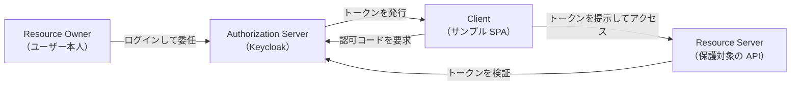

import ProgressChecklist from '../../../components/ProgressChecklist.astro';

Keycloak は独自プロトコルを話しているわけではなく、**OAuth 2.0** と **OpenID Connect（OIDC）**
という2つの業界標準プロトコルを実装したソフトウェアです。ここでは、この2つが何を解決するのか、
そして Keycloak の管理画面に出てくる用語（Realm・Client・User・Role・Scope）が
標準仕様のどの概念に対応するのかを整理します。

## OAuth 2.0 は「認可」、OIDC は「認証」

この2つは名前が似ていますが役割が異なり、混同すると理解がぶれるので最初に区別します。

- **OAuth 2.0（認可 / Authorization）**: 「あるアプリに、特定のリソースへのアクセスを
  委任する」ための仕組み。もともとは「あるサービスが、自分の代わりに別のサービスの API を
  呼び出してよい」という**委任の枠組み**として設計された
- **OpenID Connect（認証 / Authentication）**: OAuth 2.0 の上に「ログインしたユーザーが誰か」を
  伝える層を足した拡張仕様。**ID トークン**という、ユーザー情報を含む JWT を発行する

Part 1 で `alice` としてログインできたのは OIDC の働きです。一方で、SPA がログイン後に
バックエンド API を呼び出せるのは OAuth 2.0 の働きです。Keycloak は両方を同時に話すため、
「認証と認可を両方やってくれるサーバー」として振る舞います。

## 登場人物（ロール）

OAuth 2.0 / OIDC の仕様には、次の4つの登場人物が出てきます。

| 登場人物 | 役割 | このサイトでの例 |
|---|---|---|
| Resource Owner | リソースの持ち主。多くの場合は人間のユーザー | `alice` / `bob` |
| Client | Resource Owner に代わってリソースへのアクセスを要求するアプリ | サンプル SPA |
| Authorization Server | 認証を行い、トークンを発行するサーバー | Keycloak |
| Resource Server | トークンを受け取り、保護されたリソースを提供するサーバー | 保護対象の API（[Part 3.6](/part3-handson/6-api-protection/) で登場） |

## Keycloak 用語との対応

Keycloak の管理画面（Admin Console）を開くと、Realm・Client・User・Role・Scope という
言葉が出てきます。これらは OAuth 2.0 / OIDC の標準用語そのものではなく、
**Keycloak が標準仕様を実装する上で導入した管理単位**です。対応関係は次の通りです。

| Keycloak 用語 | 意味 | 標準仕様との関係 |
|---|---|---|
| **Realm** | ユーザー・クライアント・ロールなどをひとまとめにする独立した管理単位（テナント） | 標準仕様には存在しない Keycloak 独自の概念。1つの Keycloak サーバーに複数の Realm を作り、組織やプロダクトごとに認証設定を分離できる |
| **Client** | Realm に登録された、認証を要求するアプリケーション | OAuth 2.0 の **Client** に対応 |
| **User** | Realm に登録されたユーザーアカウント | OAuth 2.0 / OIDC の **Resource Owner**（人間の場合）に対応 |
| **Role** | ユーザーに割り当てる権限のまとまり。Realm 全体で使う *realm role* と、特定の Client 内でのみ使う *client role* がある | OIDC の標準クレームには無いが、`roles` などのクレームとしてトークンに含められる（Keycloak 独自の拡張） |
| **Scope** | クライアントが要求する権限の範囲（例: `openid`, `profile`, `email`） | OAuth 2.0 / OIDC の **Scope** に対応。Keycloak では *Client Scope* としてグルーピングして管理する |

たとえば Part 1 で使った `demo` realm には、`frontend-spa` という Client と、
`alice` / `bob` という User が登録されていました。`bob` にだけ `admin` という Role が
割り当てられているのも、この対応表に沿った設定です（[Part 3.5](/part3-handson/5-roles-claims/)
で実際に UI への反映を扱います）。

:::note
Realm だけは OAuth 2.0 / OIDC の標準仕様には出てこない、Keycloak（および多くの IdP 製品）
が持つ**マルチテナント機能**のための概念です。1つの Keycloak サーバーで複数の組織・
プロダクトの認証をまとめて運用するときに、設定やユーザーを分離するために使います。
:::

<ProgressChecklist />

## 次へ

用語の対応がつかめたところで、次はいよいよ Part 1 で体験したログインの裏側 ——
Keycloak が実際にどんな通信をしていたのかを、シーケンス図で追っていきます。

[Part 2.3: Authorization Code Flow + PKCE を図で追う](/part2-concepts/3-auth-code-pkce/)
