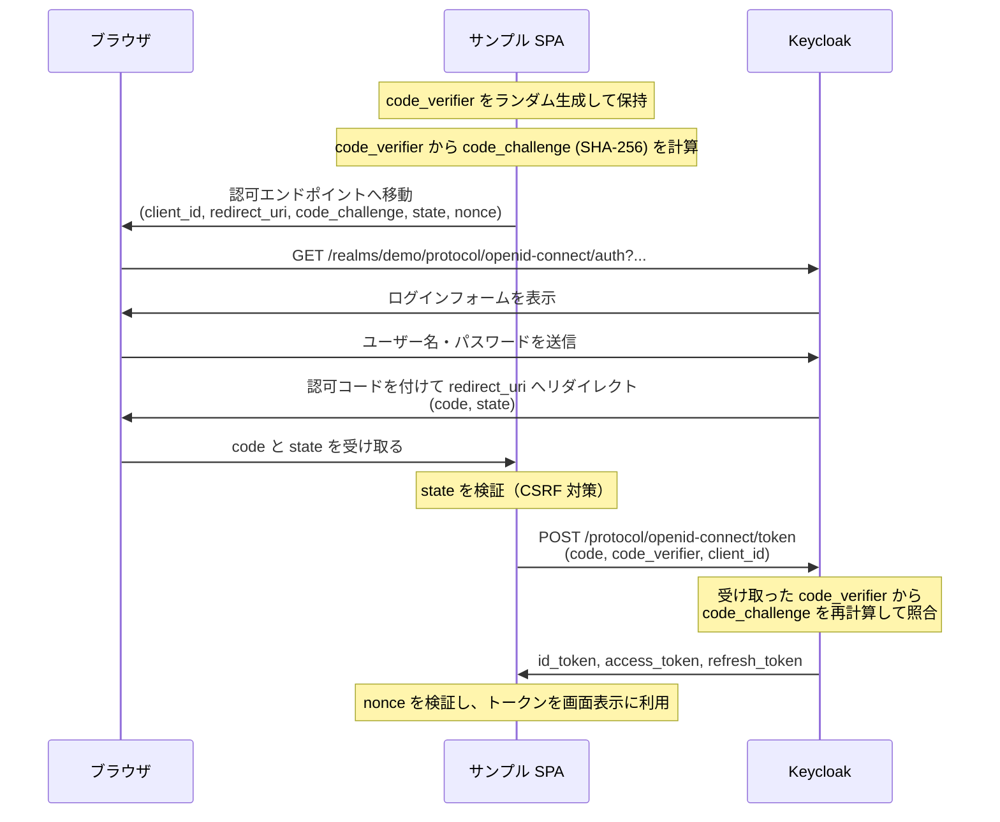

Part 1.2 でログインしたとき、ブラウザのアドレスバーが一瞬 `localhost:8080`（Keycloak）に
切り替わったのを覚えているでしょうか。あれは **Authorization Code Flow（認可コードフロー）**
と呼ばれる、OAuth 2.0 / OIDC で最も標準的なログインフローの一部でした。ここでは、その全体を
1ステップずつ図で追いかけます。

## 全体の流れ



## ステップごとの解説

### 1. SPA が code_verifier / code_challenge を用意する

SPA はランダムな文字列（`code_verifier`）を生成し、その SHA-256 ハッシュを
`code_challenge` として計算します。`code_verifier` は SPA 側だけが保持し、外には出しません。
これが **PKCE（Proof Key for Code Exchange）** の準備です。なぜこれが必要かは、
後述の「なぜ PKCE が必要なのか」で説明します。

### 2. 認可エンドポイントへリダイレクト

SPA はブラウザを Keycloak の**認可エンドポイント**へ移動させます。Part 1.2 で実際に
発生したリクエストは、次のようなクエリパラメータを持っていました（一部抜粋・整形）。

```
GET /realms/demo/protocol/openid-connect/auth
  ?client_id=frontend-spa
  &redirect_uri=http://localhost:5173/
  &response_type=code
  &response_mode=fragment
  &scope=openid
  &state=...
  &nonce=...
  &code_challenge=...
  &code_challenge_method=S256
```

`response_type=code` が「認可コードを使うフロー」であることを、`code_challenge_method=S256`
が PKCE を使うことを示しています。`state` は CSRF 対策、`nonce` は ID トークンの
リプレイ対策のための使い捨て値です。

### 3. ユーザーがログインする

Keycloak がログインフォームを表示し、ユーザーが認証情報を入力します。
**この時点でパスワードを見るのは Keycloak だけで、SPA は一切関与しません。**
これが [Part 2.1](/part2-concepts/1-idp/) で触れた「認証を IdP に丸投げする」の実体です。

### 4. 認可コードを受け取る

認証に成功すると、Keycloak は `redirect_uri`（SPA の URL）に **認可コード（code）** を
付けてブラウザをリダイレクトさせます。この時点ではまだトークンは発行されておらず、
「トークンと交換できる引換券」を受け取っただけの状態です。

### 5. トークンエンドポイントで code を交換する

SPA は受け取った `code` と、最初に生成した `code_verifier` を**トークンエンドポイント**に
送信します。Keycloak は送られてきた `code_verifier` から `code_challenge` を再計算し、
ステップ2で受け取っていた値と一致するかを検証します。一致して初めて、
ID トークン・アクセストークン・リフレッシュトークンが発行されます。

## なぜ PKCE が必要なのか

サンプル SPA のようにブラウザ上で動くアプリは、**クライアントシークレットを安全に
保持できません**（JavaScript のコードは誰でも読めるため）。このようなクライアントを
**パブリッククライアント**と呼びます。

シークレットを使えないパブリッククライアントでは、悪意のある別のアプリが何らかの方法で
認可コード（ステップ4の `code`）を横取りできてしまうと、そのままトークンを取得されてしまう
リスクがあります。PKCE は「トークンと交換できるのは、`code_challenge` を最初に提示した
のと同じ `code_verifier` を持つクライアントだけ」という制約を課すことで、
code を横取りされてもトークンの不正取得を防ぎます。

keycloak-js はこの PKCE(S256) をデフォルトで有効にしているため、
[Part 3.2](/part3-handson/2-keycloak-js/) で見るように、私たちが明示的に設定しなくても
安全な方式が自動的に使われます。

## エンドポイントはどこから分かるのか

`auth` や `token` などのエンドポイント URL は、Keycloak が Realm ごとに公開している
**OIDC Discovery ドキュメント**（`.well-known/openid-configuration`）から取得できます。

:::tip[今すぐ試す]
Keycloak が起動していれば、実際に確認できます。

```bash
curl -s http://localhost:8080/realms/demo/.well-known/openid-configuration | jq
```

**期待される結果**（抜粋）:

```json
{
  "issuer": "http://localhost:8080/realms/demo",
  "authorization_endpoint": "http://localhost:8080/realms/demo/protocol/openid-connect/auth",
  "token_endpoint": "http://localhost:8080/realms/demo/protocol/openid-connect/token",
  "userinfo_endpoint": "http://localhost:8080/realms/demo/protocol/openid-connect/userinfo",
  "end_session_endpoint": "http://localhost:8080/realms/demo/protocol/openid-connect/logout",
  "jwks_uri": "http://localhost:8080/realms/demo/protocol/openid-connect/certs"
}
```
:::

keycloak-js もライブラリ内部でこのドキュメントを参照しており、私たちが個々の
エンドポイント URL を手で組み立てる必要はありません。主要なエンドポイントの一覧は
[Part 6: リファレンス](/part6-reference/endpoints/)にもまとめます。

## 次へ

概念編はここまでです。次の Part 3 からは、実際に Admin Console を操作して
Realm・Client・User を自分の手で作りながら、ここで見た仕組みをコードとして
組み立てていきます。

[Part 3.1: Realm / Client / User を自分の手で作る](/part3-handson/1-realm-client-user/)
