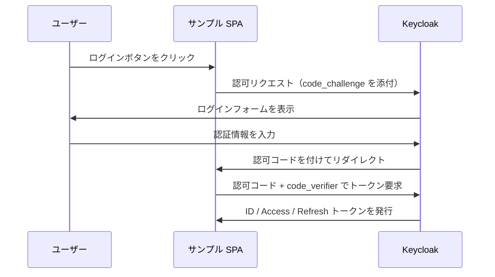

:::caution[執筆中]
このページはサイドバー構成の骨格として作成されたプレースホルダーです。内容は後続フェーズで執筆します。
:::

Mermaid の動作確認用に、Authorization Code Flow + PKCE の概略図を仮置きしています（本文は未執筆）。

```mermaid
sequenceDiagram
    participant User as ユーザー
    participant SPA as サンプル SPA
    participant KC as Keycloak

    User->>SPA: ログインボタンをクリック
    SPA->>KC: 認可リクエスト（code_challenge を添付）
    KC->>User: ログインフォームを表示
    User->>KC: 認証情報を入力
    KC->>SPA: 認可コードを付けてリダイレクト
    SPA->>KC: 認可コード + code_verifier でトークン要求
    KC->>SPA: ID / Access / Refresh トークンを発行
```
