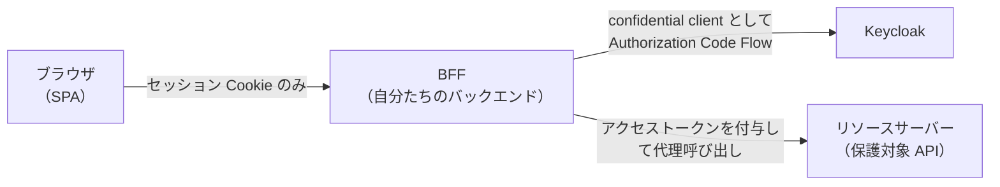

import ProgressChecklist from '../../../components/ProgressChecklist.astro';

Part 1〜3 で作ったサンプル SPA は、Keycloak の**パブリッククライアント**としてブラウザの中で
直接トークンを扱う構成でした。これは Keycloak 公式の JavaScript アダプタが想定する、
最も基本的な構成です。一方で、セキュリティ要件がより高い実務のシステムでは、
**BFF（Backend for Frontend）パターン**が推奨されることがあります。ここでは何が公式の
Keycloak ドキュメントの範囲で、何が業界のベストプラクティスなのかを区別しながら解説します。

:::note[このページの情報源について]
Keycloak 自体は BFF パターンを実装する専用機能を提供しているわけではありません。
以下の内容は主に IETF の Best Current Practice ドラフト
**「OAuth 2.0 for Browser-Based Applications」**（`draft-ietf-oauth-browser-based-apps`、
2026年8月時点でドラフト段階）に基づく、ブラウザアプリ全般に向けた業界標準の推奨事項です。
:::

## BFF パターンとは

BFF パターンでは、SPA は Keycloak と直接やり取りしません。代わりに、SPA と同じチームが
管理する**専用のバックエンド（BFF）**が、SPA の代理として OAuth のやり取りを行います。

BFF の役割は次の3つです。

1. **confidential client として Keycloak とやり取りする**（クライアントシークレットを
   安全に保持できるのはサーバーサイドだからこそ可能）
2. **ID/Access/Refresh トークンをサーバー側のセッションに保存する**（ブラウザにトークンを
   一切渡さない）
3. **API へのリクエストを代理（プロキシ）し、必要なアクセストークンを付与する**

ブラウザに渡るのは、`HttpOnly` な**セッション Cookie**だけです。

## Part 1〜3 の構成との違い

| | 今回のサンプル SPA（パブリッククライアント） | BFF パターン |
|---|---|---|
| Keycloak とやり取りする主体 | ブラウザ上の JavaScript | サーバーサイドの BFF |
| Client の種類 | パブリッククライアント | confidential client |
| トークンの保存場所 | ブラウザのメモリ（[Part 3.3](/part3-handson/3-tokens/)） | BFF 側のサーバーセッション |
| XSS でトークンが漏れるリスク | メモリ上の変数を直接読まれれば理論上あり得る | ブラウザにトークンが存在しないため原理的に発生しない |
| サードパーティ Cookie の影響 | [Part 4.1](/part4-real-world/1-third-party-cookies/) の問題を受ける | BFF が自分のオリジンの Cookie だけで完結するため影響を受けない |

## なぜ全部を BFF にしないのか

BFF パターンは安全性を大きく高めますが、代わりに**専用のバックエンドを1つ用意して
運用し続ける**という明確なコストが発生します。IETF のドラフトも、BFF をあらゆる場面での
唯一の正解とはしておらず、トークンをブラウザに渡しつつ発行・更新だけをバックエンドが仲介する
**Token-Mediating Backend（TMB）**のような、中間的な構成にも触れています。

このサイトのハンズオンでパブリッククライアント構成を選んだのは、[Part 1](/part1-quickstart/1-docker/)
で触れた通り「まず動かして仕組みを理解する」ことを優先したためです。実務でどこまでの
構成を選ぶかは、扱うデータの機密性や開発・運用コストとのバランスで判断することになります。

<ProgressChecklist />

## 次へ

[Part 4.3: dev と prod の違い](/part4-real-world/3-dev-vs-prod/)
